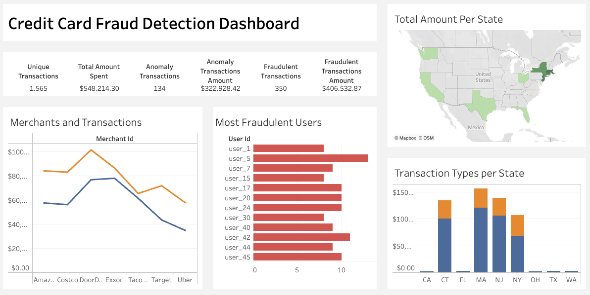

# Credit-Card-Fraud-Detection-Pipeline

This project demonstrates a full end-to-end **real-time fraud detection system** for credit card transactions using the Microsoft Azure ecosystem and visualized in Tableau. It ingests streaming transaction data, performs anomaly detection, risk scoring, and outputs visual insights into fraudulent activity across states, users, and time.

---
## Pipeline Flow
1. Transaction Simulation: Synthetic transactions are generated using Python and are ingested via Azure Event Hubs
2. Data Streaming (DataBricks): Incoming Data is streamed into a Delta Lake for storage and analysis
3. Exploratory Data Analysis (EDA): Data is analyzed to detect patterns, behaviors, and data completeness
4. Anomaly Detection: z-score is calculated and used to identify unusual transaction amounts
5. Risk Scoring: Transactions are evaluted using custom rules that are dependent on amount, location and merchant. These factors are used to determine whether a transaction is fraudulent or not
6. Synapse Integration: Transactions that are flagged with risk scores are written into a Synapse SQL table
7. Dashboad: A Tableau dashboard is used to visualize key insights like fraud over time, amount spent per location, and top risky users/merchants
---
## File Description:
### simulate_transactions.py
- Simulates credit card transactions with random values for users, merchants, location and amount spent
- Data is sent to Azure Event Hubs every few seconds to simulate streaming ingestion

### 01_stream_data.py
- Connects to the Event Hubs and reads the data being streamed in
- Parses the transactions and stores them into Delta Lake for persistent storage and further analysis

### 02_EDA.ipynb
- Conduct basic exploratory data anylsis on the simulated data
- Generates summaries, distrtibutions and pots to understand the transaction behavior

## 03_Anomaly_Detection.ipynb
- Calculates a z-score for each transaction based on the amount
- Any transaction amount where |z-score| > 3 gets flagged as an anomaly (`anomaly_flag = 1`)

## 04_write_to_synapse.py
- Writes the data to Synapse SQL Pool for structured querying
- Uses JDBC connection for secure transmission

## 05_calculate_risk.ipynb
- Calculates a `risk_score` for each transaction based on location, amount spent, and specific merchants
- Higher `risk_score` indicates a higher likelihood of fraud

## create_table.sql
- SQL script used to create the `FraudFlags` table in Synapse
---
## Dashboard
[](https://us-east-1.online.tableau.com/#/site/rajdeepsingh9613-60cc67e78b/views/CreditCardFraudDetectionProject/CreditCardFraudDetectionDashboard?:iid=1)
---
## Technologies Used

- **Azure Event Hubs** – Real-time ingestion of streaming transactions
- **Azure Databricks** – Data processing, anomaly detection, and risk scoring (PySpark)
- **Azure Synapse Analytics** – Storage and querying of processed data
- **Tableau** – Dashboard for KPI and fraud visualizations
- **Python** – Local simulation of transactions
- **SQL** – Analytical queries in Synapse

---

## Project Pipeline Overview

```plaintext
Local Simulation Script
        ↓
Azure Event Hub (Streaming Ingestion)
        ↓
Azure Databricks (Real-time ETL + ML)
        ↓
Azure Synapse (Cleaned Data Warehouse)
        ↓
Tableau Dashboard (Insights & Reporting)
```

